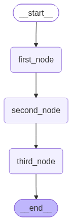
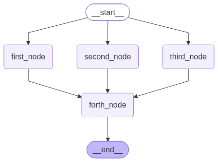
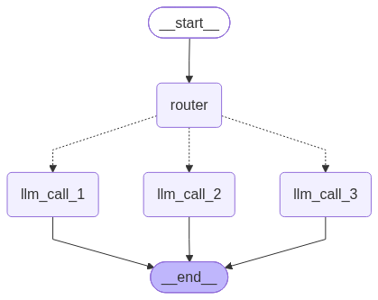
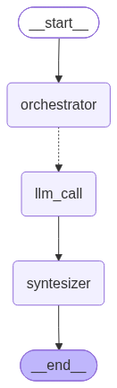
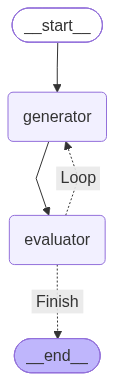
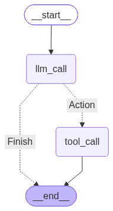

# Building Effective Agents

Implementations of the workflows from the **[Building Effective Agents with LangGraph](https://www.youtube.com/watch?v=aHCDrAbH_go)** video, following the corresponding [LangGraph documentation](https://docs.langchain.com/oss/python/langgraph/workflows-agents).

## Setup

This project uses [uv](https://docs.astral.sh/uv/).

Clone the repository and create the environment from the existing `pyproject.toml` and `uv.lock`:

```bash
uv sync
```

Then run any workflow with:

```bash
uv run <file_name>.py
```

For example:

```bash
uv run promt_chaining_workflow.py 
```

---

## 1. Prompt Chaining

Sequential LLM calls where the output of one step becomes the input of the next.



---

## 2. Parallelization

Multiple independent LLM tasks run in parallel and their results are combined into a final output.



---

## 3. Routing

An LLM decides which specialized workflow should handle the input.



---

## 4. Orchestrator-Worker

An orchestrator dynamically breaks a task into subtasks, delegates them to workers, and combines their results.



---

## 5. Evaluator-Optimizer

One LLM generates an output while another evaluates it, creating an iterative generation → evaluation → improvement loop.



---

## 6. Agents

A dynamic workflow where the LLM decides which actions or tools to use and continues iterating until the task is complete.



---

Built with **Python, LangGraph, LangChain, and Ollama**.
